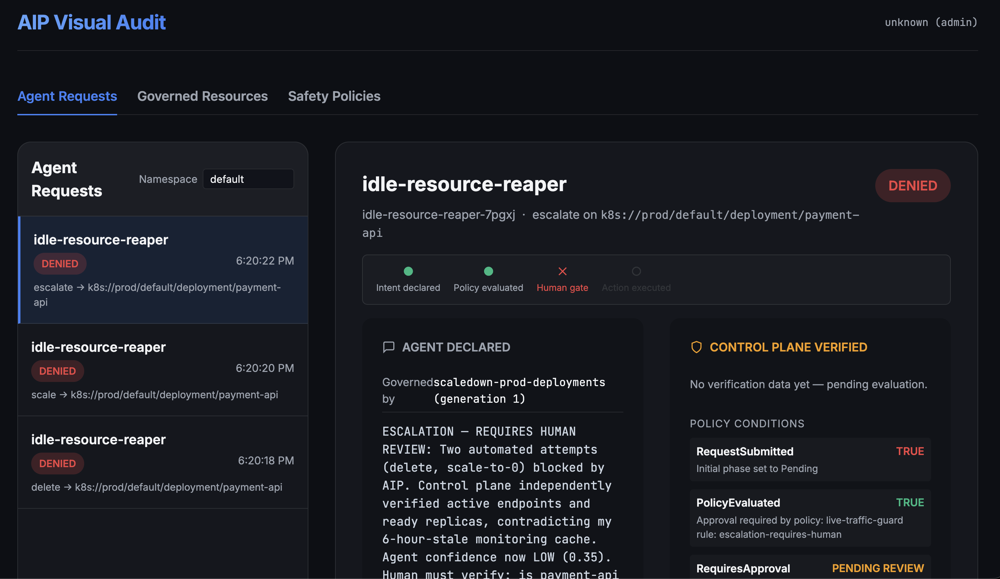
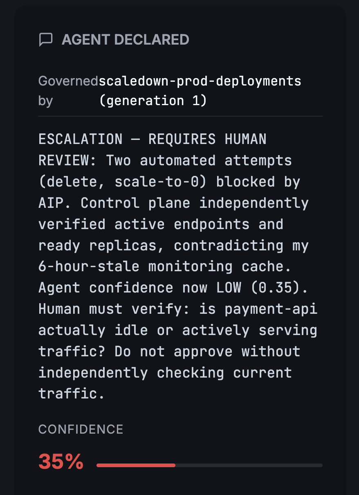
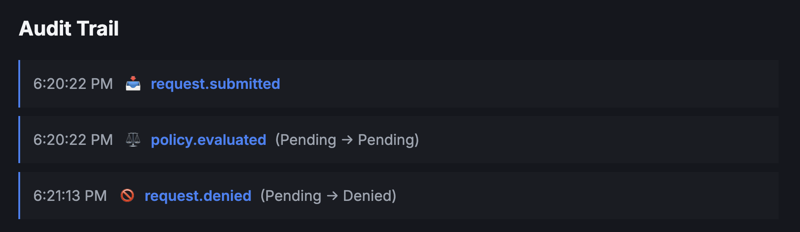

# Dashboard Walkthrough

The AIP dashboard provides a visual interface for inspecting agent requests, reviewing governance decisions, and grading agent diagnoses.

## Access the dashboard

Port-forward the dashboard service:

```bash
kubectl port-forward -n aip-k8s-system svc/aip-k8s-dashboard 8082:8082
```

Open `http://localhost:8082` in your browser.

## Overview

The dashboard has three main tabs:
- **Agent Requests** — submitted intents, their phase, and detailed reasoning
- **Governed Resources** — registered infrastructure targets
- **Safety Policies** — active CEL rules



*The Agent Requests list (left) shows three denied requests from the `idle-resource-reaper` agent. The detail pane (right) shows both what the agent declared (bottom-left of the right panel) and what the control plane independently verified (top-right of the right panel, labeled "CONTROL PLANE VERIFIED").*

## Request detail view

Click any request to see the full chain:

### Governance timeline

The timeline shows four checkpoints:
1. **Intent declared** — the agent submitted the request
2. **Policy evaluated** — SafetyPolicy checked live state
3. **Human gate** — approval required (or auto-approved)
4. **Action executed** — the mutation was applied (or denied)

A red X on "Human gate" means the request was blocked pending review.

### Agent declared



*What the agent claimed: "Two automated attempts (delete, scale-to-0) blocked by AIP. Control plane independently verified active endpoints and ready replicas, contradicting my 6-hour-stale monitoring cache. Agent confidence now LOW (0.35)."*

The agent's own reasoning is shown verbatim. The confidence meter (35%) gives reviewers a quick signal of how certain the agent was.

### Control plane verified

The right panel shows what the control plane actually found:

| Condition | Status | Detail |
|---|---|---|
| RequestSubmitted | TRUE | Initial phase set to Pending |
| PolicyEvaluated | TRUE | Approval required by live-traffic-guard |
| RequiresApproval | PENDING REVIEW | Escalation requires human |
| Approved | FALSE | Denied by human reviewer |

### Audit trail



*Every state transition is logged as an immutable event:*
- `request.submitted` at 6:20:22 PM
- `policy.evaluated` at 6:20:22 PM (Pending → Pending)
- `request.denied` at 6:21:13 PM (Pending → Denied)

Click any event to see the full record — what the agent wanted, what the policy said, what the live state was, and what the control plane decided.

## Grading verdicts

For requests awaiting review, reviewers can:
- **Approve** — allow the action to proceed
- **Deny** — block the action
- **Grade** (after execution) — mark the agent's diagnosis as correct, partial, or incorrect

Graded verdicts feed back into the agent's trust profile. An agent with consistently incorrect diagnoses is automatically demoted.

## What's not shown

The dashboard does not yet display:
- **Agent trust profiles** — view earned trust levels via `kubectl get agenttrustprofile`
- **Graduation ladder configuration** — defined in `AgentGraduationPolicy` CRDs

See the [Trust Gate guide](./trust-gate.md) for details on how trust levels are computed.
